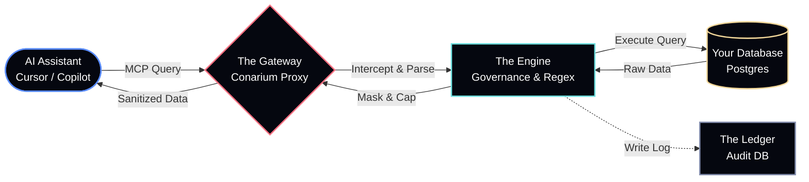

<div align="center">
  <h1>Conarium</h1>
  <p><strong>The Third Eye for Your Company's Data.</strong></p>
  <p>A self-hosted, governed gateway that lets AI coding assistants (Cursor, Copilot, Claude) touch your real data—without exposing a single secret—and hands you a signed, independently verifiable receipt of every access.</p>
  
  <p>
    <a href="https://conarium.dev"></a>
    <a href="https://github.com/dogrucanemek-alt/conarium/blob/main/LICENSE"></a>
    <a href="https://github.com/dogrucanemek-alt/conarium/blob/main/LICENSE"></a>
    
  </p>
</div>

<br/>

The site lives at [conarium.dev](https://conarium.dev); this repository is the product.

## Limitations

What this repository has **not** done is in [LIMITATIONS.md](LIMITATIONS.md)
([Türkçe](LIMITATIONS.tr.md)). The dated comparison page is
[conarium.dev/compare.html](https://conarium.dev/compare.html) — that is the
only copy; this repo does not keep a second one.

## 👁️ The Problem

Point Cursor or Copilot at a production database and it drinks the raw stream—SSNs, credit cards, salaries, and live keys. One rogue prompt can expose your most sensitive tables. Security teams simply can't allow that.

## 🛡️ The Solution: Conarium

Conarium acts as a high-performance **MCP (Model Context Protocol) Proxy**. It sits directly between the AI Assistant and your databases, evaluating policies in milliseconds to enforce row limits and mask PII (Personally Identifiable Information) on the wire.

The AI gets the context it needs to write code, but never sees your secrets.

### Key Features

- **Inline PII Masking:** Emails, IDs, cards, and secrets are redacted in the response stream (`[MASKED_PII]` / `[MASKED_SECRET]`) before the model sees a single character.
- **Allow / Deny Lists:** Whitelist what AI can access. Your `secrets` and `financials` tables stay invisible.
- **Row Caps:** Hard per-query limits. Prevent the silent exfiltration of millions of rows. 
- **Immutable Audit Ledger:** Every access is logged (who, what, when, rows, decision). Hash-chained and PII-safe — no raw PII ever written to the logs.
- **Verifiable Receipts:** Ed25519-signed, independently verifiable receipts — see below.
- **Per-person masking profiles:** what to mask for an AI agent is not what to mask for the data controller. A named profile relaxes masking for one identified person, and the receipt records which profile applied — see below.
- **Coverage & Reconciliation:** a signed coverage declaration over the receipt chain (`conarium-coverage`), plus two-sided reconciliation against the database's own query counters (`conarium-reconcile`) — DB-recorded activity that no receipt covers is surfaced instead of staying invisible.
- **100% Self-Hosted:** Runs entirely on your infrastructure. Your data never crosses your perimeter. The gateway makes exactly one outbound request that is not yours: at startup it asks the public npm registry whether a newer version exists, and prints one line to stderr if so. It sends nothing about you — no identifier, no config, no counts — and a remote gateway nobody looks at for weeks is the reason it exists at all. Disable it with `CONARIUM_NO_UPDATE_CHECK=1`, or point it at your internal mirror with `CONARIUM_NPM_REGISTRY`. It has a 2-second timeout and never blocks or fails startup. We list it here because a governance product that makes an undisclosed outbound connection has already lost the argument.
- **MCP-Native:** Works out of the box with **Cursor**, **GitHub Copilot**, **Claude Code**, and **Codex**.

### Verifiable Receipts

Conarium can emit portable **receipts** (Art. 12 / 19 shaped) that a third party
verifies offline with a single file — no Conarium install required.

**Official claim (do not widen):** A Conarium Receipt proves that the records
**still in the file** have not been altered, reordered, or backdated after they
were created, and that none were **removed from the middle** of the chain
(`prevHash` / `seq`). It does **not** prove they were correct at the moment of
creation. It also cannot, by itself, prove that records were not **dropped from
the end**: a shorter leftover chain is still internally consistent. Catching
tail truncation needs a pin from outside the file — `--expect-count`,
`--expect-last-hash`, an OpenTimestamps anchor, or `conarium-reconcile` against
the database's own counters.

*(TR)* Conarium Makbuzu, dosyada **hâlâ duran** kayıtların oluşturulduktan sonra
değiştirilmediğini, **ortadan** silinmediğini, yeniden sıralanmadığını ve geriye
dönük tarihlenmediğini kanıtlar. **Oluşturma anında doğru olduğunu kanıtlamaz.**
Sondan kesmeyi tek başına göremez: kalan zincir tutarlıdır, yalnızca kısadır.

```bash
# Generate an Ed25519 keypair (private PEM + .pub.pem + .keyid sidecars).
# The .keyid sidecars are not optional: without them the verifier answers 13
# for every receipt, which reads like tampering and is not.
npx conarium-init

export CONARIUM_AUDIT_SIGNING_KEY=./audit-ed25519.pem

# Verify a receipt chain (exit 0 = the records *in the file* are intact)
npx conarium-verify ./receipts.jsonl --pubkey ./audit-ed25519.pub.pem

# Pin length / last hash if you need to catch records dropped from the end
npx conarium-verify ./receipts.jsonl --pubkey ./audit-ed25519.pub.pem --expect-count 3

# Optional: check OpenTimestamps sidecar (pending → exit 0 + warning; missing → 14)
npx conarium-verify ./receipts.jsonl --pubkey ./audit-ed25519.pub.pem --anchor-check
```

Opt-in anchoring: `CONARIUM_ANCHOR_SINK=opentimestamps`. Upgrade pending proofs later with
`npx conarium-anchor-upgrade ./audit.jsonl.anchors.jsonl`.
The client is in-tree (Node `crypto` + calendar HTTPS). It does not install
`javascript-opentimestamps`. See [LIMITATIONS.md](LIMITATIONS.md).

### Per-person masking profiles

Masking that is correct for an AI agent is wrong for the person who owns the data.
The owner asking *"which customer owes the most"* needs the name; the assistant
summarising revenue does not. Answering that with a global on/off switch would
disable the product's only real guarantee, so masking resolves **per person**:

```jsonc
{
  "policy": {
    "allowTables": ["zion.customers", "zion.orders"],
    "maskColumns": ["*.customer_name", "*.email", "*.phone"],  // default: everyone
    "maxRows": 100,

    "profiles": {
      // The controller sees customer names; email and phone stay masked.
      "controller-full": { "maskColumns": ["*.email", "*.phone"], "maxRows": 1000 }
    },
    "actorProfiles": { "emekcan": "controller-full" }
  }
}
```

Deliberately narrow, because this is the one feature that can *loosen* protection:

- A profile may override **`maskColumns`, `maxRows` and `maskLabelledNames` — and
  nothing else.** Table, tool and connector permissions stay global; a profile can
  never widen what is reachable, only what is legible within it.
- **Per-user tokens only.** An actor authenticated with a shared token never
  receives a profile. "Whoever holds this string sees unmasked PII" is precisely
  the failure this product exists to prevent.
- **Fail-closed everywhere else:** no actor, unlisted actor, or a profile name that
  does not exist all fall back to the base policy, never to a wider one.
- **The content scanners still run.** Email / national-ID / phone / card /
  IBAN / secret detectors are not overridable at all, so those stay masked in free
  text no matter which profile applied. IBAN is accepted only when ISO 7064
  mod-97-10 holds. Passport MRZ (TD3, 7-3-1 check digits) is on by default and
  likewise cannot be turned off by a profile — only `policy.detectors.mrz: false`
  on the **base** policy opts it out. IP addresses are **off** until
  `policy.detectors.ip: true`. Name masking is the one detector a profile can
  switch off (`maskLabelledNames: false`), because the controller reading their
  own customer list is the case this feature exists for.
- **The receipt says which profile applied** — `policy.id` becomes
  `conarium.policy/<profile>`, inside the signed hash. An access made under a
  relaxed profile cannot later be presented as having been fully masked. This is
  what keeps the audit story honest: the point was never "nobody sees PII", it is
  "every access is governed, and the evidence says under which rules."

### Names in free text

Every other identifier has a shape. An email has an `@`, a national ID has a
checksum, a card has a length — a regex decides, and the decision reproduces.
A name has no shape, so `maskColumns` was the only thing catching one, and a name
typed into a free-text `note` reached the model verbatim.

Two deterministic passes close the part of that gap that can be closed honestly:

| Pass | What triggers it | Example |
|---|---|---|
| **Carry-over** | The value is one **this policy already masks** in some column | `customer_name` is masked, so `note: "Ayşe Demir called"` is masked too — including across rows |
| **Labelled** | The **text itself** marks it: a title or a field label | `Sn. Ahmet Yılmaz`, `Yetkili: Ayşe Demir`, `customer: John Smith` |

**What this does not do, deliberately: a bare name in running prose is not
detected.** "Ahmet called yesterday" goes through. Catching that needs NER — a
model, a dictionary and a confidence score — and every decision this gateway
makes is meant to be reproducible from the rule alone, by someone who does not
trust us. A probabilistic masker would also be a probabilistic *receipt*. Tools
that do run NER (Presidio-based ones, for instance) cover more entity types; they
buy that with a confidence threshold. Neither position dominates — this one is
stated so an auditor knows which one they are holding.

**Still not caught by content scanners — by design, not by omission:** street
addresses and bare names. An address detector cannot tell "Atatürk Caddesi No:15"
from "Atatürk Barajı" without a gazetteer. A name detector cannot tell Deniz /
Güneş / Umut from the words. Both would need a dictionary or a model; this
gateway's decisions are deterministic. Close those gaps with `maskColumns` (column
names) and `conarium-suggest-policy` (a name-based *guess* that does not write
your config).

IP addresses are caught **when you turn them on** (`policy.detectors.ip: true`).
They are off by default: a server IP is not always personal data, and a mask you
cannot disable breaks SOC work. `1.2.3.4` is structurally a valid IPv4 address;
when the detector is on it is masked, even if you meant a version number. Dates
(`13.08.2026`) and amounts (`1.250,00`) are not IPv4.

Passport numbers in free text are not caught. **MRZ is:** two TD3 lines × 44
characters, `P` in position 1, 7-3-1 check digits. A checksum miss is not an MRZ
and is left alone. TD1/TD2 are not implemented.

HTML `&#64;` / `&#x40;`, JSON `\u0040`, and `%40` are masked when they sit inside
an email-shaped token. A lone `5&#64; store` or `C:\path\u0040abc` is left alone.
One decode pass; `&amp;#64;` is not chased.

A TCKN split across two similarly named fields on the same row (`tckn_1` /
`tckn_2`) is masked when the concatenation checksums. Unrelated columns are not
combined.

Zero-width characters, fullwidth digits / `＠`, and unicode dashes are stripped
or mapped to ASCII *before* the detectors — that pass is not a general encoding
decoder; wrapped base64/hex *tokens* inside a field are masked only when they
decode to an existing detector hit.

**Scan length.** A single text field longer than `policy.scanCharCap` (default
16 384; env `CONARIUM_SCAN_CHAR_CAP` overrides) is replaced with `[MASKED_PII]`
as a whole, even when it contains no identifier. The scanner is not skipped:
skipping would mean a long note, JSON blob, or log line is the way past masking.
This is a **usability** setting. Raising it grows scan cost quadratically — a
40 KB alphanumeric field was ~1 s on the unbounded email regex before that regex
was bounded. `maskedCount` records that a decision was made.

Carry-over ignores values under three characters (a two-character value matches
everywhere and would shred the output) and matches on Unicode word boundaries, so
`Ali` is masked in `Ali onayladı` but not inside `Kalite`.

### Coverage & reconciliation (bypass detection)

Receipts prove what went **through** the gateway. Reconciliation asks the database
what it saw, and compares:

```bash
# One-sided: signed coverage declaration over a period + declared scope
npx conarium-coverage ./declaration.json --pubkey ./audit-ed25519.pub.pem --receipts ./receipts.jsonl

# Two-sided: reconcile the DB's own per-role query counters against receipts.
# Snapshots come from pg_stat_statements (scripts/pg-snapshot.sql), taken at
# window start and window end with a dedicated DB role per gateway instance.
npx conarium-reconcile --before before.json --after after.json --receipts ./receipts.jsonl
# exit 0  = every DB query pattern in the window is covered by receipts
# exit 40 = the DB recorded activity no receipt covers — the gateway may have
#           been bypassed, or the receipt sink failed
```

The language is deliberate: absence is reported as **"access NOT RECORDED"** /
**"not receipted"**, never "no access occurred" — an absent record is ambiguous
by nature, and a tool that pretends otherwise is lying to its auditor.

Run against our own production ERP the day it shipped, including a real bypass we
performed on ourselves and the tool caught:
[`docs/dogfood/2026-08-06-reconcile.md`](docs/dogfood/2026-08-06-reconcile.md).

Full schema, exit codes, and known gaps: [`docs/RECEIPT-SPEC.md`](docs/RECEIPT-SPEC.md).

### Implementing the format yourself

The receipt is meant to outlive this implementation, so it ships with
conformance vectors — nine frozen cases plus a machine-readable manifest in
[`test-vectors/`](test-vectors/):

```bash
npm run test:vectors     # our verifier against the frozen cases
```

Point your own verifier at each `receipts.jsonl`, pass the arguments listed in
`manifest.json`, and compare the exit code. `expected-hashes.json` gives the
canonical JCS → SHA-256 hashes so you can check your canonicalisation without
needing our private key, which is deliberately not published.

The vectors found two things in this repository on their first run: a schema
check that reported a structurally invalid receipt as *tampered*, and a wrong
assumption of ours about unsigned receipts. Both are now frozen as cases 007
and 008.

### Anchoring your chain (optional)

`conarium-stamp` anchors a file to the OpenTimestamps calendars, and
`conarium-anchor-upgrade` fills in the Bitcoin block height once it lands.
Those two are all most setups need.

If you would rather expose anchoring as a small service — for several
gateways, or to hand an auditor a stable URL —
[`bin/conarium-anchor-service.mjs`](bin/conarium-anchor-service.mjs) is one:
it submits hashes, retains proofs, serves the raw `.ots` at a permanent path,
and upgrades pending anchors on a timer.

It is code you run, not a service we operate — there is no hosted instance to
sign up for. It also serves the raw proof precisely so a third party can verify
with the reference OpenTimestamps client and ignore the service entirely. An
anchoring endpoint you have to trust would defeat the purpose of anchoring.

Signing is fail-closed: set `CONARIUM_AUDIT_SIGNING_KEY` and/or
`CONARIUM_AUDIT_HMAC_KEY`, or explicitly `CONARIUM_AUDIT_UNSIGNED=1` for throwaway setups.
Key rotation: keep prior public PEMs in `CONARIUM_AUDIT_TRUST_PUBKEYS` (`,` / `;`
separated). After the first signed audit line, every later line must carry `sig`.

### Where this sits among similar projects

Conarium is **not** the first project to produce signed, verifiable receipts for AI
activity. [Acta](https://github.com/VeritasActa/Acta),
[Emilia Protocol](https://github.com/emiliaprotocol/emilia-protocol),
[AuthProof](https://github.com/Commonguy25/authproof-sdk),
[Agent Receipts](https://github.com/agent-receipts) and
[Invariant SVR](https://github.com/Jasonleonardvolk/invariant-svr) all do a form of this,
and some are ahead of us on standardisation — Acta and Emilia both have IETF
Internet-Drafts. Related research: Aegon (arXiv 2604.06693), Decentralised Trust Layers
(ACM Web Conf 2026), and ISO/IEC TS 27560:2023 for signed consent records.

Those receipts attest to what an agent **did**. A Conarium receipt attests to what the
model was **prevented from seeing** — because the component that masks the data is the
same component that signs the record. Enforcement and evidence are one part here, not
two systems that have to be reconciled.

What we will defend: Conarium is the only implementation we are aware of that combines
all three of **(1) inline enforcement** (policy + masking), **(2) a portable,
offline-verifiable receipt** of that enforcement, and **(3) coverage
reconciliation** — checking the database's own query counters against the receipt
chain, so access that bypassed the gateway is surfaced instead of staying
invisible. Signing receipts without enforcing is common; enforcing without
portable receipts is common; reconciling both sides against the data source's
own bookkeeping is the part we have not found elsewhere. Measured end to end on
a real operating company's live ERP — 121,374 records, 121,366 identities
masked, 485,496 fields masked, zero leaked to the model
([Governance Report 001](https://conarium.dev/report-001.html)).

**What that number is, and what it is not.** It comes from a batch run against
our own company's ERP, and what backs it is a **hash-chained audit file** of 123
lines whose arithmetic you can re-add yourself and whose chain was re-verified 17
days later. What does *not* back it is a **receipt chain**: that run emitted audit
entries, not signed portable receipts, and its actor is a batch service identity,
not a person. So if you ask "show me the receipts for those 485,496 fields", the
honest answer is that they do not exist — the receipt chain is a separate and much
smaller measurement. Scale and offline verifiability are two different claims here,
and we would rather draw that line ourselves than have you find it. The mechanism
is verifiable without trusting us; this particular figure is our own measurement,
and [Governance Report 001](https://conarium.dev/report-001.html) lists its limits.

That claim is hedged on purpose, and [`docs/PRIOR-ART.md`](docs/PRIOR-ART.md) is the
evidence behind it: ten projects checked on 6 August 2026, what each one has, the
closest academic prior art ([Sello / *Notarized Agents*](https://arxiv.org/html/2606.04193v1),
which names this gap better than we did), and nine things we could **not** verify. If
you know of an implementation combining all three, open an issue and it will be
corrected.

---

## 🏗️ Architecture (The Trifecta)

Conarium operates on a strict tripartite architecture, balancing power between three pillars:


```mermaid
graph LR
    A([AI Assistant\nCursor / Copilot]) -- "MCP Query" --> B{The Gateway\nConarium Proxy};
    B -- "Intercept & Parse" --> C[The Engine\nGovernance & Regex];
    C -- "Execute Query" --> D[(Your Database\nPostgres)];
    D -- "Raw Data" --> C;
    C -- "Mask & Cap" --> B;
    B -- "Sanitized Data" --> A;
    C -. "Write Log" .-> E[The Ledger\nAudit DB];
    
    style A fill:#05070f,stroke:#5a8cff,stroke-width:2px,color:#fff
    style B fill:#05070f,stroke:#ff6f80,stroke-width:2px,color:#fff
    style C fill:#05070f,stroke:#6fe0e0,stroke-width:2px,color:#fff
    style D fill:#05070f,stroke:#f2d79a,stroke-width:2px,color:#fff
    style E fill:#05070f,stroke:#838dad,stroke-width:2px,color:#fff
```

1. **The Gateway:** A proxy that speaks fluently to LLM assistants.
2. **The Engine:** Evaluates JSON policies, regex scans, and row caps in milliseconds.
3. **The Ledger:** An immutable audit log recording every query and decision.

---

## 🚀 Quick Start

```bash
# 1. Install
npm i @conarium-ai/core

# 2. Write a fail-closed skeleton (config + Ed25519 pair + .keyid sidecars)
npx conarium-init
export CONARIUM_AUDIT_SIGNING_KEY="$PWD/audit-ed25519.pem"

# 3. Check the install before trusting it
npx conarium-doctor

# 4. Point the generated conarium.config.json at your read-only DSN,
#    fill policy.allowTables, then run the governed MCP gateway
npx conarium
```

Step 3 is not decoration. A missing config file does **not** stop the gateway —
it starts with zero connectors and governs nothing — and a connector that fails
to connect is logged, not raised. `conarium-doctor` names both, exits `1` when
something is wrong so it can gate a deployment, and never prints a secret, so
its output is safe to paste into an issue.

<details>
<summary>From source instead</summary>

```bash
git clone https://github.com/dogrucanemek-alt/conarium.git
cd conarium
npm install && npm run build
node bin/conarium-init.mjs
node bin/conarium-doctor.mjs --no-net
npm start
```

</details>

`conarium-init` refuses to overwrite existing files unless you pass `--force`.
It never prints the private key — only its path.

### Desktop shortcut for the console

The policy editor is `npx conarium-console`. It still binds `127.0.0.1` and
still requires a token. These two commands only add a door on the desktop:

```bash
npx conarium-console --install-shortcut
npx conarium-console --uninstall-shortcut
```

| | |
|--|--|
| Windows | `.lnk` on the desktop (console window minimized) |
| macOS | `~/Applications/Conarium Console.app` |
| Linux | `~/.local/share/applications/conarium-console.desktop` |

Double-click starts the same console, waits until the port is listening, then
opens your browser. The token is not put in the URL; a one-time nonce (≤30s)
is exchanged for a session cookie. If a shortcut with that name already exists,
a `-2` suffix is used instead of overwriting.

Export `CONARIUM_CONSOLE_TOKEN` before `--install-shortcut` so the launcher
can read it from `~/.conarium/console.token` (created `0600`). The shortcut
file itself does not contain the token.

The shortcut uses `assets/conarium-mark.ico` / `.icns` / `-512.png`,
all from the same SVG. If those files are missing the shortcut is still
created and the command warns.

The console **Makbuzlar** tab lists signed receipts from `audit.receiptSink`
(newest first) and shows the same receipt HTML as `demo.conarium.dev/proof`.
It verifies the hash chain and writes **zincir sağlam** or **kırık (satır N)**.
If the sink is empty or unset, it says so — it does not invent a sample
receipt. Audit Logs remain the unsigned playground trail; they are not receipts.

When the package is on npm, the same binaries will ship in the tarball
(`conarium-init`, `conarium-doctor`, `conarium-verify`, `conarium-suggest-policy`).
Until then, run them from this repository as above.

### Before you file a bug: run the doctor

`conarium-doctor` checks the things that fail quietly. Two of them matter most:
a **missing config file does not stop the gateway** — it starts with zero
connectors and governs nothing — and a **connector that cannot connect is logged,
not raised**, so the process looks healthy while serving nothing. The doctor also
catches the missing `<pubkey>.keyid` sidecar, which makes every receipt verify as
`13` (reads like tampering, isn't).

It exits `0` when clean and `1` when something is wrong, so it can gate a
deployment. **It never prints a secret** — passwords, tokens and key material are
reported as shape only (`postgresql://appuser@db.internal:5432/prod (password
set, not shown)`), which means the output is safe to paste into an issue or an
email.

Conarium speaks MCP over **stdio**, so your AI assistant launches it as a command. Add this to your MCP client config (e.g. Cursor):

```json
{
  "mcpServers": {
    "conarium": {
      "command": "npx",
      "args": ["-y", "--package=@conarium-ai/core", "conarium", "--config", "/path/to/your/conarium.config.json"]
    }
  }
}
```

## ⚙️ Configuration (Policy as Code)

Control access using a simple `conarium.json` policy file:

```json
{
  "maxRows": 50,
  "allowTables": ["public.customers", "public.orders"],
  "denyTables": ["public.secrets", "public.financials"],
  "maskColumns": ["email", "ssn", "*.card", "*.api_key"],
  "allowConnectors": ["postgres-main", "docs"]
}
```

Anything not in `allowTables` is denied by default; matched `maskColumns` are redacted to `[MASKED_PII]` before the data ever reaches the model.

> **Connectors are fail-closed.** `allowConnectors` is a strict allow-list:
> if it is missing or empty, **no** connector is permitted (previously an empty
> list meant "allow all"). If you configure connectors, you must list them here —
> otherwise the server refuses to start and tells you exactly which field to add.
> `denyConnectors` still takes precedence over `allowConnectors`.

### `policy.detectors` and `policy.scanCharCap`

Identity detectors — TCKN, card, IBAN, email — cannot be switched off. A config
that tries (`detectors: { tckn: false }`) is rejected at load. That is the
product: masking that a bank can disable from a JSON file is not masking.

| Key | Default | Why |
|---|---|---|
| `detectors.ip` | `false` | A server IP is not always personal data. A mask with no off switch breaks SOC ("how many requests from this address?"). Opt in when the column really is a client address. |
| `detectors.mrz` | `true` | A passport MRZ is identity and has check digits. Turn off on the base policy if you do not handle travel documents. |
| `scanCharCap` | `16384` | Usability. Fields longer than this are replaced whole (`[MASKED_PII]`), never skipped. Env `CONARIUM_SCAN_CHAR_CAP` overrides. Raise it and scan cost grows quadratically. Ceiling 1 048 576. |

```json
{
  "scanCharCap": 32768,
  "detectors": { "ip": true }
}
```

### `policy.customPatterns`

Formats the built-in detectors do not know — a bank customer number, a
house account code — can be registered as extra rules on the **same**
scanner. This is not a second masking path and it does not replace
`maskColumns`.

Each rule needs a name (what the receipt records), a pattern, optional
column globs, and a mask label. A broken or ReDoS-shaped pattern rejects
the config; the pattern text is never written to logs or receipts.

```json
{
  "customPatterns": [
    {
      "name": "teb-hesap",
      "pattern": "HSP-[0-9]{8}",
      "columns": ["*.hesap_no"],
      "label": "[MASKED_HESAP]"
    }
  ]
}
```

Quantifiers must be bounded (`{8}`, `{4,12}`). `+`, `*`, nested groups and
lookaround are rejected at load. A rule names a format you already know;
it does not invent one.

`conarium-suggest-policy --sql schema.sql` prints a `maskColumns` guess from
column names (`*name*`, `*address*`, `*tckn*`, …). It does not write your
config. The first line of the output says so.

## 🗺️ Roadmap

Conarium is **early access** — and honest about what's real:

**Shipping now:** governed MCP gateway (stdio + HTTP) · deterministic PII masking,
including labelled names in free text · allow/deny + row caps · per-person masking
profiles · immutable hash-chained audit ledger · Ed25519-signed receipt per access
with an offline verifier · signed coverage declarations · two-sided reconciliation
against the database's own counters · OpenTimestamps anchoring and an optional
anchoring service · conformance vectors · Postgres, Supabase, docs, OpenAPI, Jira
and Slack connectors · `conarium-init` / `conarium-doctor` from source (npm
publish is the remaining step before `npx` works).

**Next:** consent binding ([spec published](docs/CONSENT-BINDING-SPEC.md), no code —
patent review first) · a second independent implementation of the receipt format ·
per-user identity bound to an identity provider rather than an operator token map ·
publishing `@conarium-ai/core` to npm so `npx conarium-init` works without a clone.

**Deliberately not planned**, so nobody waits for it:

- **LLM-based "semantic" masking.** The gate is deterministic on purpose. A
  probabilistic mask would make a probabilistic receipt, which is not a receipt.
- **Hosted cloud console.** Self-hosted is the claim; a hosted console would put
  us in the data path we tell you we are not in.
- **SOC 2.** It audits organisations that hold customer data. We never receive
  yours. If that ever stops being true, this line changes first.

Known gaps: [LIMITATIONS.md](LIMITATIONS.md), the README above, and
[`docs/RECEIPT-SPEC.md`](docs/RECEIPT-SPEC.md).

## 📜 License

MIT — all of it, including the verifier, the reconciliation tooling and the
anchoring service. There is no feature held back for a paid tier; what
[conarium.dev](https://conarium.dev) sells is support, not access to code.
